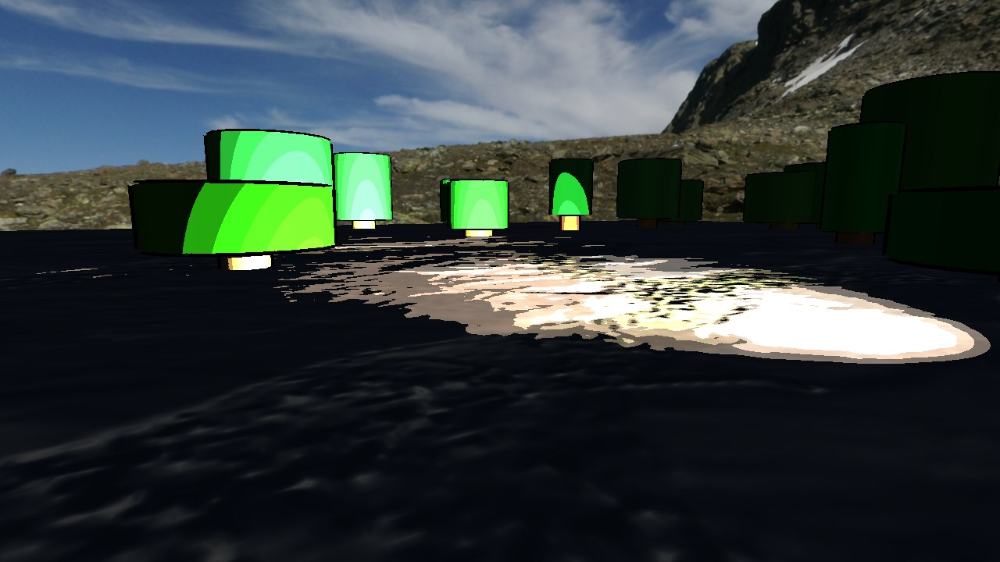
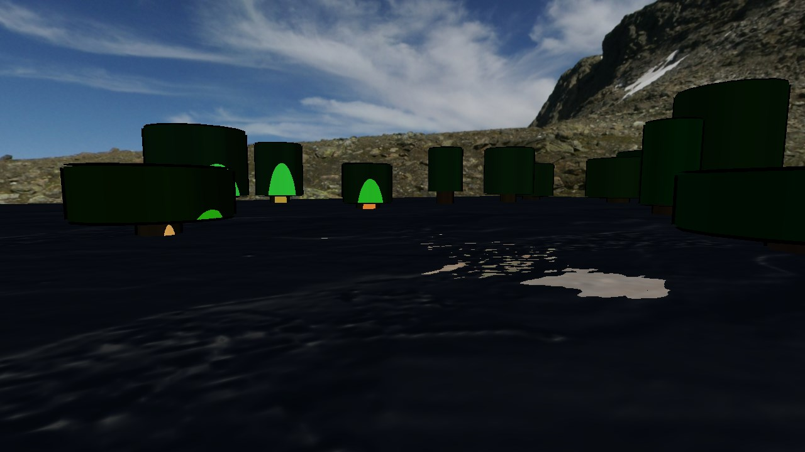
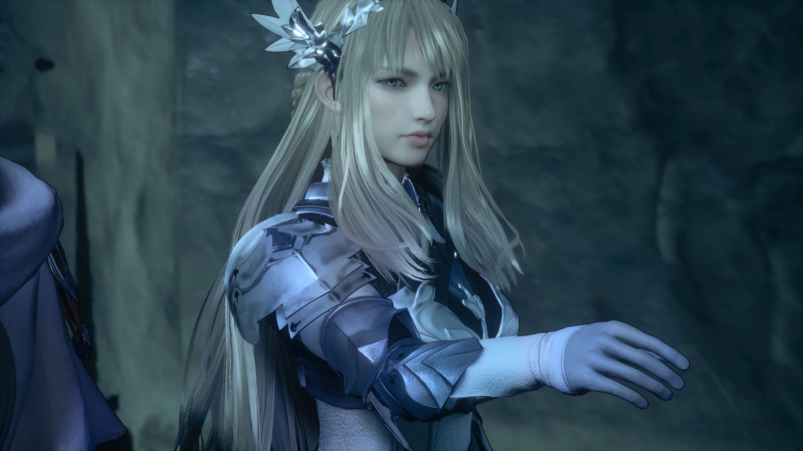
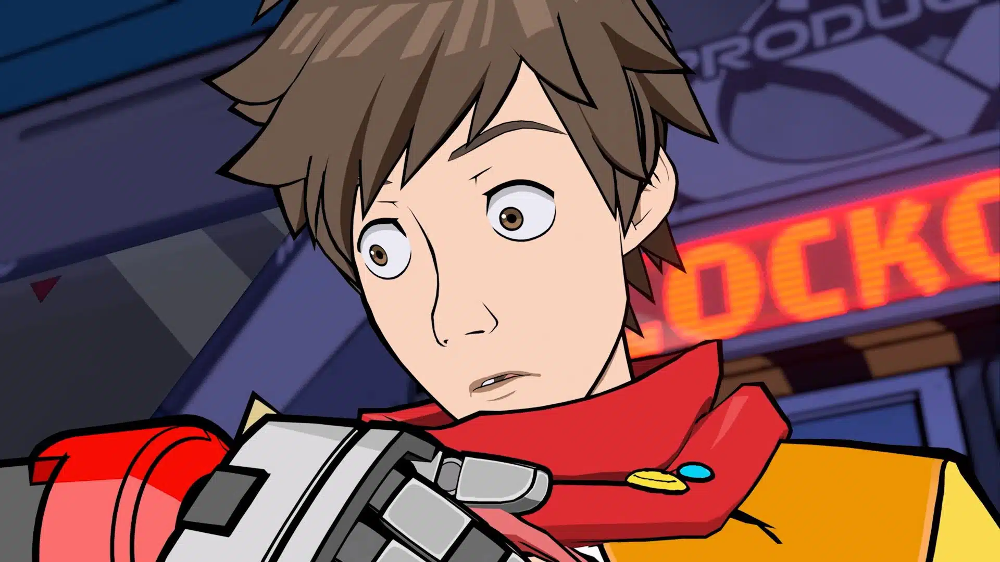
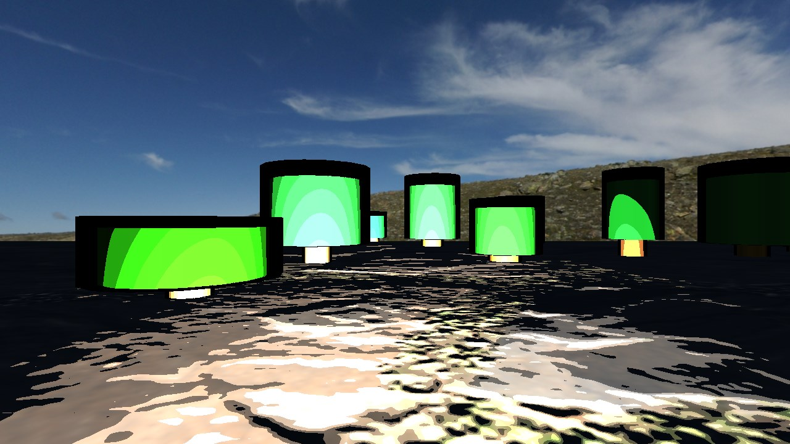
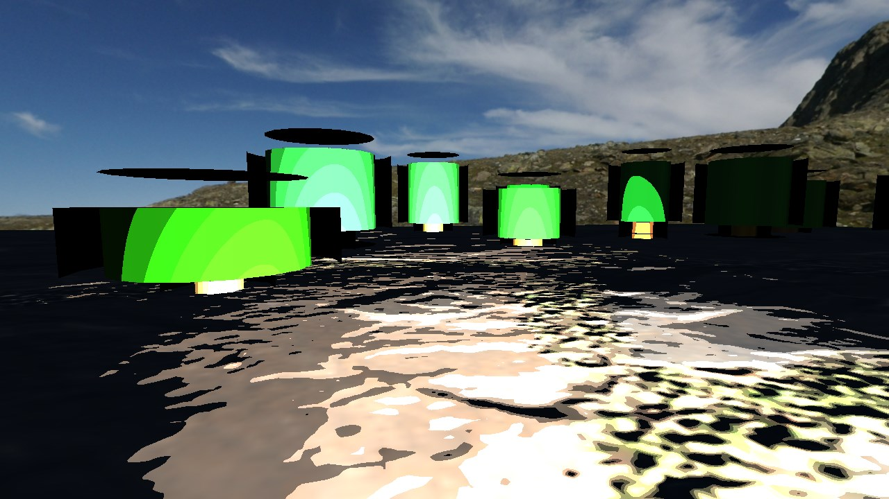

# Toon shader with outlines for OpenTK base application in C#

This project was made within the scope of the Computer Graphics unit of the
Videogames course in Universidade Lusófona, using a OpenTK app as a base in 
order to apply a toon shader with outlines to objects.

## Toon Shading Algorithm and Process

Making a toon shader is not very complicated in theory-- you calculate the
light for the pixel normally with all of its needed components, but afterwards 
you **band** the result, which generates hard levels of shadows instead of a linear,
smoothly lit object (normally acheived in shader via the *floor* function
with the light result clamped between 0 and 1, and then dividing said result
by 0.(amount of bands)).

The implementation used here is based on that, but instead of being applied
to the final light value, it's applied to all light steps (diffuse, specular,
and shadows, then multiplied by color) with 7 bands:

The shader has also been applied to the ground for a better look on the different
bands. A smaller number of bands could also be applied here, but does not look that
visually pleasing in this specific example (2 bands, lit and not lit 
essentially):

Another way to make the toon effect, and one that may even be better, is to
utilize a **color ramp** (this was suggested by Professor 
[Diogo de Andrade][DAndrade]). In this approach, after the lighting is calculated,
instead of banding it traditionally, you use this value to look up a 2D Texture
with a gradient, and the spot where this value falls in will be the final
light component.

In this way, band transitions and even each band's color can be controlled 
non-linearly, allowing for more artistic control. This would also better
the image above (with 2 bands) without needing to change the light's position,
since we could then control where the shadows would be exactly.

This was not implemented on this project, however, due to time constraints and 
the fact that the direct light is not simply multiplied to the material's color 
in all light types except directional, which would require various lookups.

The vertex and frag toon shaders are located in the **Shader** folder under the
following names:

`phong_pp_toon.frag`
`phong_pp_toon.vert`

## Outline Shading Process

### Methods and theory

There are many ways to outline objects, maybe even more than toon shading
techniques. Some of them even have most of the process encapsulated on the 
rendering pipeline, with only a simple shader to make it completely dark
(such as simply having a duplicate, slightly scaled-up version of the model and
rendering it behind the object with all pixels having a single color. This
option is explored in detail in the third option of [this video][stencilbuffervid]). 

The option chosen here, however, was not this one since I wished to mess with
the rendering pipeline as little as possible to make the shader, and I also
wished to show outlines **even if on top of the object**, for example:

On the image above from the game **Valkyrie Elysium**, the outline is only
applied to the edges of the model with the rest of the environment (which is
what most stencil buffer/model duplicating approaches will do), instead of 
having clear outlines for the edges **of the model**, like on this next example:

On this image from the game **Hi-Fi Rush**, the outlines do appear even if
layered over the model, which can be done with an discontinuity detection algorithm 
(detailed in [this implementation][ref5]), or with many objects having separate materials with the
same shader, even.

### Chosen Method

With all of this in mind, I went with an approach similar to the second one covered in the video above-- 
which is to essentially render the object, cull the face on the front, render
a scaled-up version of the object (with a scale value being multiplied by the
position in the vertex shader), and return the cull face mode to back. This
would allow me to have my desired effect and have minimal interaction with the
rendering pipeline, but the effect won't be right if it's simply applied like
that:

The outlines are a bit overtuned to showcase the issue, but since we're
scaling the object linearly on the vertex shader and updating the position,
like that, which means that the scaling will happen around the geometrical
center of the object.

A possible solution to this is to add the vertex normal to the position and
then scale it, since this will remove it from the scale matrix:

But as can be seen, simply adding what should be a directional vector to the
position will "push" the object instead of simply making it bigger. We should
then divide / multiply the previous value that made the scaling to make the 
spots smaller:

This looks way better and is how the shader looks now, but the obvious drawback
of this approach is the fact that it doesn't cover the edges due to the 
deformation of the shape that was caused by adding the normal. With this in
mind, and in hindsight, it maybe would be better to add edge detection
algorithms, like the one referenced [here][outlinelink].

The vertex and frag outline shaders are located in the **Shader** folder under the
following names:

`outline.frag`
`outline.vert`

## References

- [GLSL Programming - Toon Shading][ref1]
- [OpenGL Tutorial 15 - Stencil Buffer & Outlining][ref2]
- [Toon Shader from Scratch - Explained!][ref3]
- [Outline effects in OpenGL][ref4]
- [3D Game Shaders for Beginners - Outlining][ref5]
- [OpenTK stencil buffer][ref6]
- [Blender Toon Shader][ref7]
- Engine and base phong shader code by [Diogo de Andrade][DAndrade]

## Licenses

Engine code developed by [Diogo de Andrade][DAndrade] and [Nuno Fachada][NFachada]; it is made available under the [Mozilla Public License 2.0][MPLv2].

Code uses:

* [OpenTK], licensed under the [MIT] license
* Grass texture by Charlotte Baglioni/Dario Barresi, under the [CC0] license
* Cubemap by [Emil Persson], under the [CC-BY3.0] license

All the text and documentation (i.e., non-code files) are made available under
the [Creative Commons Attribution-NonCommercial-ShareAlike 4.0 International
License][CC BY-NC-SA 4.0].

[MPLv2]:https://opensource.org/licenses/MPL-2.0
[CC BY-NC-SA 4.0]:https://creativecommons.org/licenses/by-nc-sa/4.0/
[CC-BY3.0]:https://creativecommons.org/licenses/by/3.0/
[CC0]:https://creativecommons.org/publicdomain/zero/1.0/
[Ap2]:https://opensource.org/licenses/Apache-2.0
[OpenTK]:https://opentk.net/
[MIT]:https://opensource.org/license/mit/
[DAndrade]:https://github.com/DiogoDeAndrade
[NFachada]:https://github.com/fakenmc
[Emil Persson]:http://www.humus.name/
[stencilbuffervid]:https://youtu.be/ngF9LWWxhd0
[outlinelink]:https://lettier.github.io/3d-game-shaders-for-beginners/outlining.html

[ref1]:https://en.wikibooks.org/wiki/GLSL_Programming/Unity/Toon_Shading#Outlines
[ref2]:https://www.youtube.com/watch?v=ngF9LWWxhd0
[ref3]:https://www.youtube.com/watch?v=owwnUcmO3Lw
[ref4]:https://stackoverflow.com/questions/12924188/outline-effects-in-opengl
[ref5]:https://lettier.github.io/3d-game-shaders-for-beginners/outlining.html
[ref6]:https://stackoverflow.com/questions/9410293/opentk-stencil-buffer
[ref7]:https://www.youtube.com/watch?v=sJTEJKQ0lYw